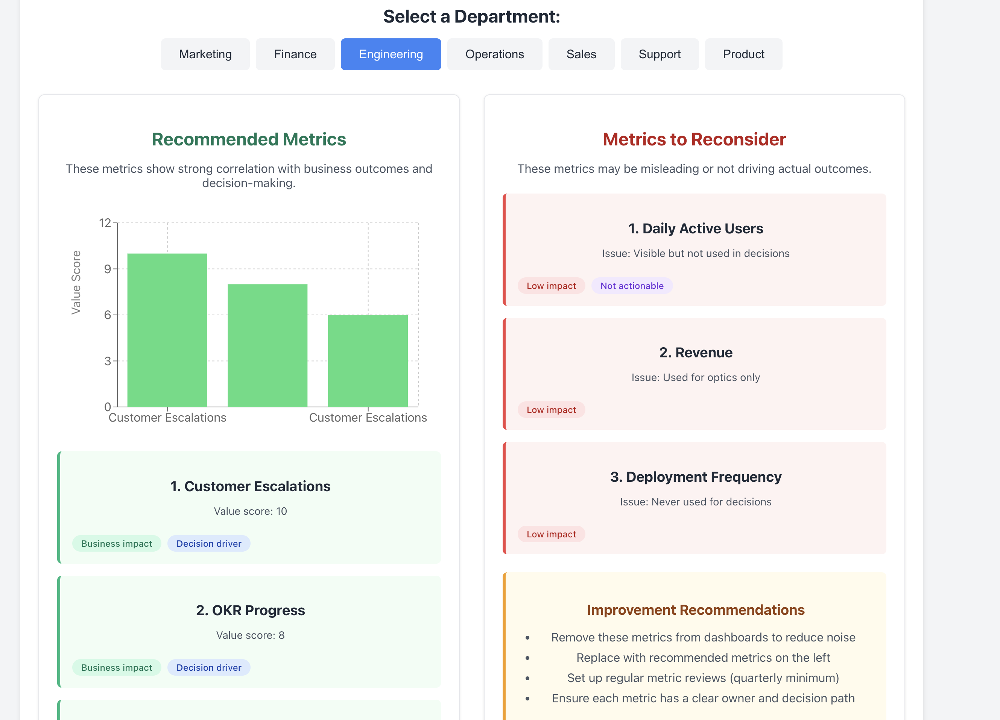

# KPI Audit Tool

An AI-powered dashboard that analyzes your metrics to identify vanity metrics and recommend actionable KPIs that drive business outcomes.




## Features

- **Dashboard Health Summary**: Shows your total metrics, how many are vanity metrics, and their percentage
- **Department Selection**: View metrics analysis for each department
- **Recommended Metrics**: Identifies the 3 most valuable metrics for each department
- **Metrics to Reconsider**: Flags metrics that may be misleading or not driving outcomes
- **Improvement Recommendations**: Practical advice to improve your metrics framework

## Getting Started

### Prerequisites

- Node.js (v14.0.0 or higher)
- npm (v6.0.0 or higher)

### Installation

1. Clone the repository:
```bash
git clone https://github.com/yourusername/kpi-audit-tool.git
cd kpi-audit-tool
```

2. Install dependencies:
```bash
npm install
```

3. Start the development server:
```bash
npm start
```

4. Open [http://localhost:3000](http://localhost:3000) to view the app in your browser.

## Usage

1. Upload your metrics CSV file with the following columns:
   - Department
   - Metric_Name
   - Visible_in_Dashboard
   - Used_in_Decision_Making
   - Executive_Requested
   - Last_Reviewed
   - Metric_Last_Used_For_Decision
   - Interpretation_Notes

2. Select a department to see its metric analysis.

3. Review recommended metrics and those flagged for reconsideration.

## Contributing

Contributions are welcome! Please feel free to submit a Pull Request.

## License

This project is licensed under the MIT License - see the LICENSE file for details.
